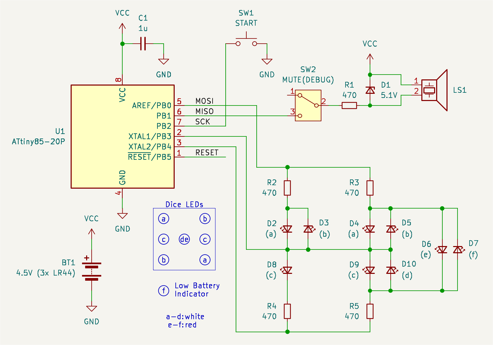
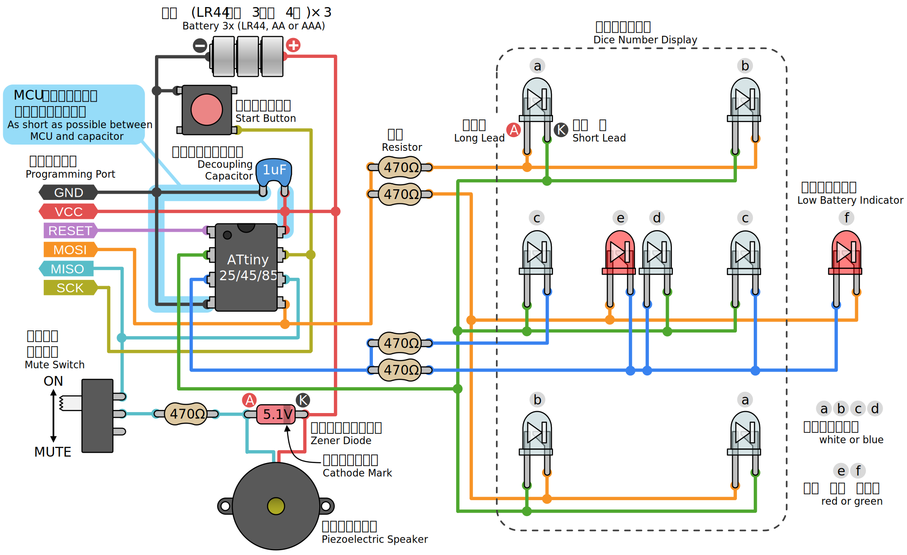
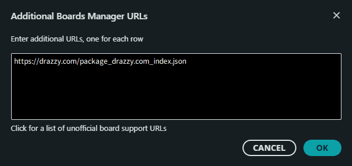
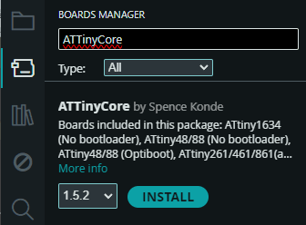
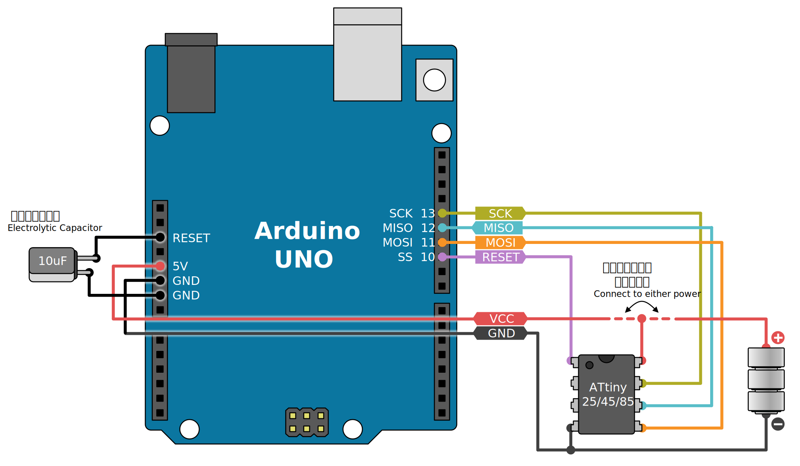

# ShapoDice (WIP)

8pin の 8bit マイコン ATtiny25/ATtiny45/ATtiny85 用の電子サイコロです。

- Arduino + ATTinyCore 使用
- 8 個の LED でサイコロの目 (&#x2680;, &#x2681;, &#x2682;, &#x2683;, &#x2684;, &#x2685;) を表示
- &#x2680; は赤色で表示
- [xoshiro128++](https://prng.di.unimi.it/xoshiro128plusplus.c) による周期の長い乱数を使用した出目の決定
- 乱数生成器の状態変数を EEPROM に保持することで起動時の出目を予測不能にする
- PWM と圧電サウンダによる効果音
- セルフパワーオフ (主電源スイッチ不要)
- バッテリー残量の低下を LED で警告

----

# ライセンス

このプロジェクトのライセンスは未定です。

このプロジェクトでは乱数生成のために [David Blackman と Sebastiano Vigna](https://prng.di.unimi.it/) による
[xoshiro128++](https://prng.di.unimi.it/xoshiro128plusplus.c) (パブリックドメイン) を改変して使用しています。

----

# ハードウェアの製作

## 必要なもの

(執筆中)

## 回路図

## 実体配線図

----

# Arduino IDE のインストール

[Arduino IDE](https://www.arduino.cc/en/software/) を未インストールの場合はインストールしてください。

> [!NOTE]
> **参考:** 本リポジトリ作成時点では Version 2.3.6 でした。

----

# AVR プログラマの用意

ここでいう「プログラマ」とは AVR にプログラムや設定の読み書きを行うための装置です。「AVRライタ」や「ダウンロードケーブル」などと呼ばれることもあります。

## 使用可能なプログラマ

<table>
    <tr>
        <th style="text-align: center;" colspan="2">プログラマ</th>
        <th style="text-align: center;">ATtiny25/45/85</th>
    </tr>
    <tr>
        <td rowspan="2">公式</td>
        <td>MPLAB PICkit 5</td>
        <td style="text-align: center;">✔</td>
    </tr>
    <tr>
        <td>AVRISP mkII (生産終了)</td>
        <td style="text-align: center;">✔</td>
    </tr>
    <tr>
        <td rowspan="3">サードパーティ</td>
        <td>USBasp</td>
        <td style="text-align: center;">✔</td>
    </tr>
    <tr>
        <td>USBtinyISP</td>
        <td style="text-align: center;">✔</td>
    </tr>
    <tr>
        <td>その他…</td>
        <td style="text-align: center;">(要個別確認)</td>
    </tr>
    <tr>
        <td colspan="2">Arduino UNO を流用 (Arduino as ISP)</td>
        <td style="text-align: center;">✔</td>
    </tr>
</table>

公式のプログラマが安心ですが、入手性が悪い場合や高くて手が出ない場合はサードパーティの製品の購入をお勧めします。USBasp や USBtinyISP は自作することも可能ですが、それら自身も AVR を使用するため、自作したものを使用できる状態にするには結局他のプログラマが必要になります。

### MPLAB PICkit 5

[MPLAB PICkit 5](https://www.microchip.com/en-us/development-tool/PG164150)

### AVRISP mkII

[AVRISP MKII | Microchip Technology](https://www.microchip.com/en-us/development-tool/atavrisp2)

既に生産終了してます。Amazon に出品されていますが正規品なのかどうかはよく分かりません。

- [Amazon で検索](https://www.amazon.co.jp/s?k=USBasp+mkII)

### USBasp

[USBasp - USB programmer for Atmel AVR controllers - fischl.de](https://www.fischl.de/usbasp/)

6pin のコネクタがあるものか、10pin → 6pin の変換コネクタが付属するものをお勧めします。

- [スイッチサイエンスで検索](https://www.switch-science.com/search?q=USBasp)
- [aitendo で検索](https://www.aitendo.com/product-list?keyword=USBasp)
- [Amazon で検索](https://www.amazon.co.jp/s?k=USBasp) 

### USBtinyISP

[Overview | USBtinyISP | Adafruit Learning System](https://learn.adafruit.com/usbtinyisp)

6pin のコネクタがあるものか、10pin → 6pin の変換コネクタが付属するものをお勧めします。

- [スイッチサイエンスで検索](https://www.switch-science.com/search?q=USBtinyISP)
- [aitendo で検索](https://www.aitendo.com/product-list?keyword=USBtinyISP&Submit=%E6%A4%9C%E7%B4%A2)
- [Amazon で検索](https://www.amazon.co.jp/s?k=USBtinyISP)

### Arduino as ISP 

[Arduino as ISP](https://docs.arduino.cc/built-in-examples/arduino-isp/ArduinoISP/#load-the-sketch)

既に Arduino UNO を持っている場合はそれをプログラマとして使用できます。Arduino as ISP 用のファームウェアは Arduino IDE にサンプルスケッチとして含まれています。

1. Arduino UNO を PC に接続します。
2. Arduino IDE を起動し、`File` → `Examples` → `ArduinoISP` → `ArduinoISP` を開きます。
3. `Tools` → `Board` の中から、接続した Arduino UNO に一致するボードを選択します。
4. `Tools` → `Port` の中から、Arduino UNO を接続したシリアルポートを選択します。
    - 複数あってどれだか分からない場合は Arduino UNO を抜き差ししてポートの増減を確認してみてください。
    - Windows の場合は tomozh さんの [PortPop](https://github.com/tomozh/PortPop) を入れておくと便利です。
5.  ボタン (Ctrl + U) でスケッチを Arduino UNO に書き込みます。

これで Arduino UNO が書き込み機として機能します。

----

# ボードのインストール

## ATtiny25/45/85 の場合

> [!NOTE]
> 関連ドキュメント:
> - [SpenceKonde/ATTinyCore: Arduino core for ATtiny 1634, 828, x313, x4, x41, x5, x61, x7 and x8](https://github.com/SpenceKonde/ATTinyCore)
> - [ATtiny85 Arduino Board: How to Flash the Arduino Bootloader and Run A Simple Sketch — Maker Portal](https://makersportal.com/blog/2018/5/19/attiny85-arduino-board-how-to-flash-the-arduino-bootloader-and-run-a-simple-sketch)

ATtiny25/45/85 はデフォルトでは Arduino IDE ではサポートされていないため、追加のボードとして「ATTinyCore」をインストールする必要があります。インストールするにはまずボードの提供元の URL を Arduino IDE に登録します。

1. Arduino IDE を起動します。
2. `Edit` → `Preferences` を開き、`Additional boards manager URLs` の入力欄の右にある  を開きます。
3. URL の入力欄に `https://drazzy.com/package_drazzy.com_index.json` を追加します。既に他の URL が入力されている場合は行を追加してください。

    

3. `OK` で `Preferences` のダイアログを閉じます。

URL を登録したら、ATTinyCore をインストールします。

1. `Tools` → `Board` → `Board Manager` を開きます。
2. キーワード欄から `ATTinyCore` を検索し  します。

    

----

# プログラマと MCU の接続

## ATtiny25/45/85 + Arduino as ISP の場合

Arduino UNO と ATtiny を次のように接続します。ATtiny の VCC は電池か Arduino UNO の VCC のどちらかを接続します。

> [!WARNING]
> Arduino UNO の VCC と電池を同時に接続しないでください。同時に接続すると Arduino UNO の VCC (5V) から電池 (4.5V) へ電流が逆流してしまいます。いきなり火を吹いたりはしないと思いますが、繋いだままにしていると電池が破裂したり液漏れする恐れがあります。

----

# ブートローダー (ヒューズ) の書き込み

Arduino スケッチを書き込む前に「ヒューズ」を書き込む必要があります。この作業は AVR のチップ毎に最初の 1 回だけ必要です。

> [!NOTE]
> **AVR におけるヒューズとは:**
> AVR の動作クロックなどを設定するための不揮発性の設定ビットの一群です。この設定を書き込んでおかないとスケッチが動作しなかったり、期待した動作にならなかったりします。 
> 参考: [ヒューズ設定 | 始めるAVR](https://startelc.com/AVR/Avr_3Wfuse.html)

> [!NOTE]
> GUI 上はブートローダーの書き込みとなっていますが、ShapoDice ではブートローダーは使用しません。ヒューズだけが書き込まれます。

## ATtiny25/45/85 の場合

1. Arduino IDE で `shapodice.ino` を開きます。
2. プログラマを PC に USB 接続します。
3. `Tools` 内の設定を次のようにします。

    |項目|値|備考|
    |:--|:--|:--:|
    |Board|ATtiny25/45/85 (No bootloader)||
    |Port|Arduino UNO を接続したシリアルポート||
    |B.O.D. Level|B.O.D. Enabled (2.7v)||
    |Chip|使用している MCU||
    |Clock Source|8 MHz (internal)|※1|
    |Save EEPROM|EEPROM retained||
    |LTO|Enabled|※2|
    |millis()/micros()|Disabled (saves flash)|※3|
    |Timer 1 Clock|CPU (CPU frequency)||
    |Programmer|使用するプログラマを選択|※4|

    > [!CAUTION]
    > **※1)** `Clock Source` の選択は重要なので間違えないようにしてください。特に `(external)` と入っているクロックを選択した場合、書き込み完了と同時に ATtiny が「文鎮化」してしまい、復活させるには外部からクロック信号を入力する必要があり、面倒です。

    > [!NOTE]
    > **※2)** LTO (Link Time Optimization) はスケッチの書き込み時に効きます。ヒューズには影響しません。

    > [!NOTE]
    > **※3)** ATtiny45/85 の場合は `millis()/micros()` は Enabled でもかまいません。Disabled の方が Flash 容量を節約できますが、`millis()` や `micros()` は使えなくなります (ShapoDice では使用しません)。

    > [!NOTE]
    > **※4)** Arduino UNO **R4** を Arduino as ISP として使用する場合は、`Programmer` として`Arduino as ISP` ではなく `Arduino Leo/Micro as ISP (ATmega32U4)` を選択してください。 
    > 参考: [Can I use the R4 minima as an icsp? - Classic / UNO R4 Minima - Arduino Forum](https://forum.arduino.cc/t/can-i-use-the-r4-minima-as-an-icsp/1170056/4)

4. `Tools` → `Burn Bootloader` をクリックします。ShapoDice はブートローダーを使用しないので、書き込まれるのはヒューズだけです。

    > [!CAUTION]
    > 書き込み中は ShapoDice に触れないでください。スイッチを操作すると ATtiny が文鎮化する恐れがあります。

----

# Arduino スケッチの書き込み

1. Arduino IDE で `shapodice.ino` を開きます。
2. プログラマを PC に USB 接続します。
3. `Tools` 内の他の設定がブートローダー (ヒューズ) 書き込み時と同じになっているのを確認します。
5.  ボタン (Ctrl + U) でスケッチを MCU に書き込みます。

    > [!CAUTION]
    > 書き込み中は ShapoDice に触れないでください。

書き込みが完了したらプログラマから切り離してください。繋いだままだとスイッチに反応しない場合があります。

----